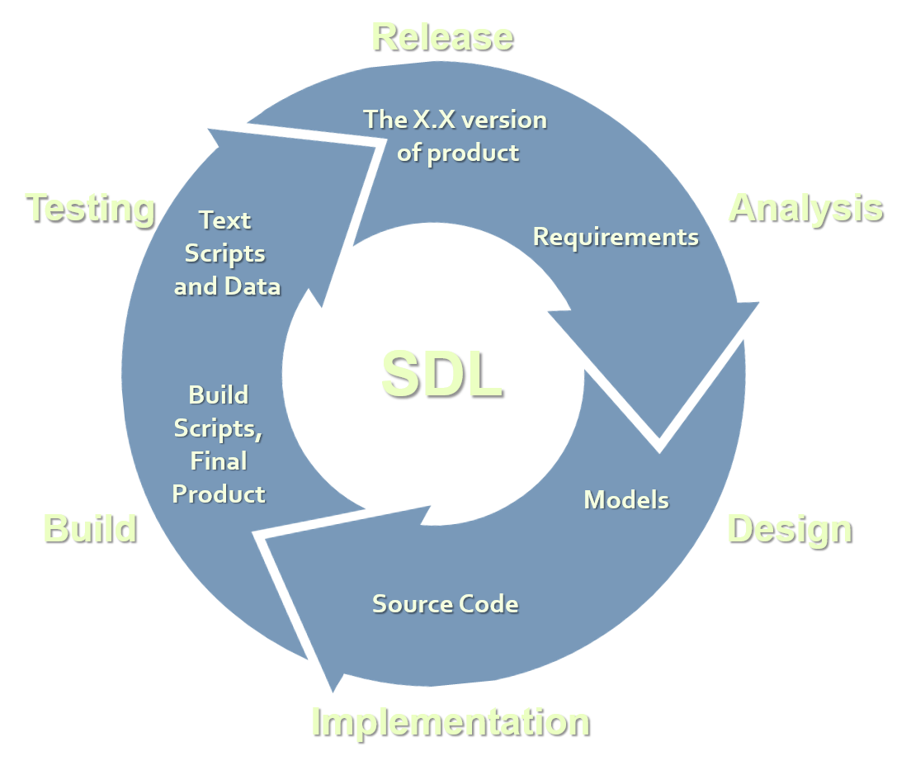

<!-- section start -->
<!-- attr: { hasScriptWrapper:true, class:"slide-title" } -->
# Software engineering
## What does it mean to be a Software Engineer?

<!--  -->
<!--  -->

   
High-Quality Code - Unit Testing

   
Telerik Software Academy

   <a href="https://telerikacademy.com" class="signature-link">https://telerikacademy.com</a>

<!-- section start -->
<!-- attr: { hasScriptWrapper:true } -->
# Table of Contents
- [Software Engineering](#)
  - [Life-cycle](#)
  - [Brief History](#)
- [Software Quality](#)
  - [Conventions](#)
  - [Characteristics](#)
- [Software Testing](#)
  - [Types and Levels](#)
  - [Process and Philosophies](#)

<!--  -->

<!-- section start -->
<!-- attr: { hasScriptWrapper:true, class:"slide-section" } -->
# Software Engineering

<!-- attr: { hasScriptWrapper:true, showInPresentation: true } -->
<!-- # Definition -->

The application of a **systematic**, **disciplined**,
**quantifiable** approach to the development, operation,
and `maintenance` of software.

-- ISO/IEEE, 2010

<!-- attr: { hasScriptWrapper:true } -->
# Software Engineering
- **Software engineering** is:
  - An engineering discipline that provides knowledge, tools, and methods for:
    - Defining software requirements
    - Performing software design
    - Software construction
    - Software testing
    - Software maintenance tasks
    - Software project management

<!--  -->

<!-- attr: { hasScriptWrapper:true } -->
# Software Life-cycle

<!--  -->

<!-- attr: { hasScriptWrapper:true } -->
# Engineering Activities
- **Software development** always includes the following activities (to some extent):
  - Requirements analysis
  - Design
  - Construction
  - `Testing`
- These activities do not follow strictly one after another (depends on the methodology)!
  - Often overlap and interact

<!-- attr: { hasScriptWrapper:true } -->
# History
- **1940s** - The first digital computers.
  - The split between hardware and software
- **1950s** - The first programming languages.
  - Fortran, ALGOL, COBOL and etc.
- **1968** - `David Parnas` introduces the concept of **modularity**.
  - **1972** - also introduces **information hiding**.
- **1968** - The first Software Engineering conference, sponsored and hosted by `NATO`.
  - The first **code conventions** and **design patterns**

<!-- attr: { hasScriptWrapper:true, showInPresentation: true } -->
<!-- # History -->
- **1979** - `Glenford J. Myers` introduces the separation of debugging from testing.
- **1988** - `Dave Gelperin` and `William C. Hetzel` classified the phases and goals in software testing.
- **1994** - `Kent Beck` releases the first version of SUnit, the first unit testing framework, designed for the language `Smalltalk`

<!-- section start -->
<!-- attr: { hasScriptWrapper:true, class:"slide-section", showInPresentation: true } -->
<!-- # Software Quality -->

<!-- attr: { hasScriptWrapper:true } -->
# Definition

**Software quality** is a customer determination, not an engineer's determination, not a marketing determination, nor a general management determination. It is based on the `customer's actual experience` with the product or service, measured against his or her `requirements` - stated or unstated, conscious or merely sensed.

-- Joseph Juran, 1988

<!-- attr: { hasScriptWrapper:true } -->
# External quality

- **External quality**
  - Does the software behave correctly?
  - Are the produced results correct?
  - Does the software run fast?
  - Is the software UI easy-to-use?
  - Is the code secure enough?

<!-- attr: { hasScriptWrapper:true } -->
# Internal quality

- **Internal quality**
  - Is the code easy to read and understand?
  - Is the code well structured?
  - Is the code easy to modify and extend?

<!-- attr: { hasScriptWrapper:true } -->
# What is High-Quality code?

- **High-quality programming code**:
  - Easy to read and understand
    - Easy to modify and maintain
  - Correct behavior in all cases
    - Well tested
  - Well written architecture and designed
  - Well documented
    - Self-documenting code
  - Well formatted

<!-- attr: { hasScriptWrapper:true } -->
# Code Conventions

- **Code conventions** are formal guidelines about the style of the source code:
  - Code formatting conventions
    - Indentation, whitespace, etc.
  - Naming conventions
    - **PascalCase** or **camelCase**, prefixes, suffixes, etc.
  - Best practices
    - Classes, interfaces, enumerations, structures, inheritance, exceptions, properties, events, constructors, fields, operators, etc.

<!-- attr: { hasScriptWrapper:true } -->
# Key Characteristics

- **Correct behavior**
  - Conforming to the requirements
  - Stable, no hangs, no crashes
  - Bug free – works as expected
  - Correct response to incorrect usage
- **Readable** – easy to read
- **Understandable** – self-documenting
- **Maintainable** – easy to modify when required  

<!-- attr: { hasScriptWrapper:true, showInPresentation: true } -->
<!-- # Key Characteristics -->

- Following the corporate **code conventions**
  - Formatting and style, naming, etc.
  - Domain-specific best practices
- Well **tested** code
  - Testable code
  - Well designed **tests**
    - Tests for all scenarios
    - High code coverage

<!-- section start -->
<!-- attr: { hasScriptWrapper:true, class:"slide-section", showInPresentation: true } -->
<!-- # Software Testing -->

# Definition
**Software testing** can provide `objective` and `independent` information about the quality of software, as well as the risks of its failure to users.

-- Cem Kaner, 2006

<!-- attr: { hasScriptWrapper:true } -->
# Software Testing

 - **Software testing** involves the execution of a software component or system component to evaluate if it:
  - Meets the development requirements
  - Responds correctly to all kinds of inputs
  - Performs its functions within an acceptable time
  - Is sufficiently usable
  - Can be installed and run in the intended environment
  - Achieves the general result its stakeholders desire

<!-- attr: { hasScriptWrapper:true } -->
# Testing Levels

- **System testing**
  - System testing tests a completely integrated system of modules to verify that the system meets its requirements
- Example:
  - Test the logon page
  - Then create or edit an entry
  - Then send or print the entry
  - Then delete or archive the entry
  - Finally logoff.

<!-- attr: { hasScriptWrapper:true, showInPresentation: true } -->
<!-- # Testing Levels -->

- **Integration testing**
  - Integration testing works to expose defects in the interaction between integrated components of a given module.
- Example:
  - Does the login page
    - Load correctly
    - Validate the input data correctly
    - Process the input data correctly
    - Redirect to the main page (or other page)

<!-- attr: { hasScriptWrapper:true, showInPresentation: true } -->
<!-- # Testing Levels -->

- **Unit testing**
  - Unit testing works to expose defects in a components of a given module.
- Example:
  - In the login page
    - Does the username field accept data
    - Does the username field validate the data
    - Does the username field retain the data
    - Does the send button have the text "Send form"
    - Does the send button actually send the form

<!-- section start -->
<!-- attr: { hasScriptWrapper:true, class:"slide-section", showInPresentation: true } -->
<!-- # Software Engineering
## Questions? -->

<!-- attr: { showInPresentation:true, hasScriptWrapper:true } -->
# Free Trainings @ Telerik Academy
- C# Programming @ Telerik Academy
    - [Unit Testing Course](http://academy.telerik.com/student-courses/programming/high-quality-code/about)
  - Telerik Software Academy
    - [telerikacademy.com](https://telerikacademy.com)
  - Telerik Academy @ Facebook
    - [facebook.com/TelerikAcademy](facebook.com/TelerikAcademy)
  - Telerik Software Academy Forums
    - [forums.academy.telerik.com](forums.academy.telerik.com)

<!--  -->
<!--  -->
<!--  -->
