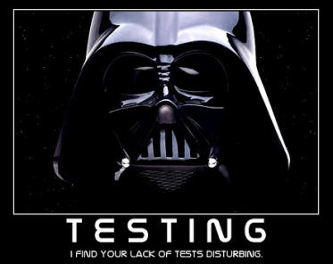
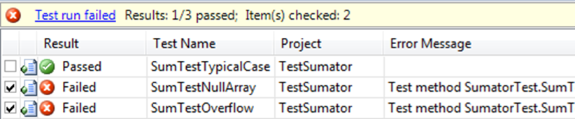
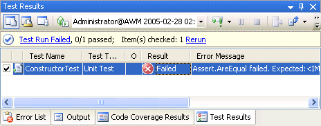
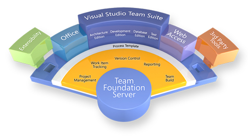
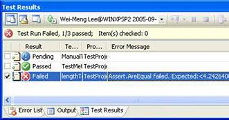
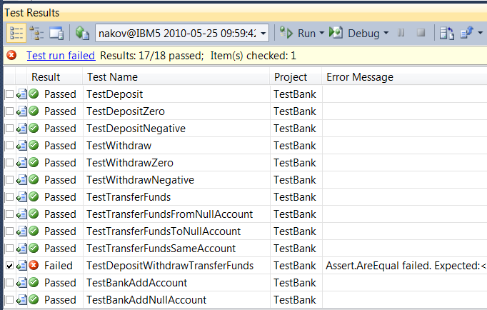
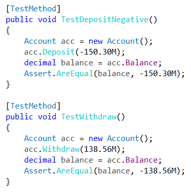
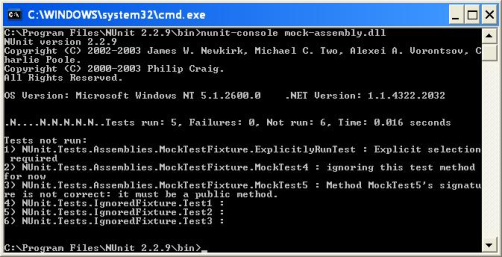
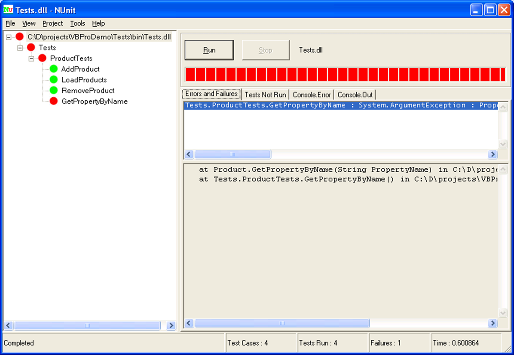
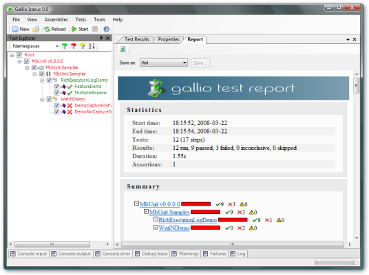

<!-- section start -->
<!-- attr: { hasScriptWrapper:true, class:"slide-title" } -->
# Unit Testing
## Building Rock-Solid Software

<!--  -->
<!--  -->
<!--  -->
<!--  -->

<div class="signature">
   <p class="signature-course">High-Quality Code - Unit Testing</p>
   <p class="signature-initiative">Telerik Software Academy</p>
   <a href="https://telerikacademy.com" class="signature-link">https://telerikacademy.com</a>
</div>

<!-- section start -->
<!-- attr: { hasScriptWrapper:true } -->
# Table of Contents
- What is Unit Testing?
- Code and Test vs. Test Driven Development
- Unit testing Frameworks
  - Visual Studio Team Test
  - Nunit
  - Gallio
- Unit Testing Best Practices

<!--  -->
<!--  -->

<!-- section start -->
<!-- attr: { hasScriptWrapper:true, class:"slide-section" } -->
# What is Unit Testing?

<!--  -->

<!-- attr: { hasScriptWrapper:true } -->
# Unit Test - Definition
A **unit test** is a piece of code written by a developer that exercises a very small, specific area of functionality of the code being tested.

**"Program testing can be used to show the presence of bugs, but never to show their absence!"**

Edsger Dijkstra, [1972]

<!-- attr: { hasScriptWrapper:true } -->
# Manual Testing
- You have already done unit testing
  - Manually, by hand
- **Manual tests** are less efficient
  - Not structured
  - Not repeatable
  - Not on all your code
  - Not easy to do as it should be

<!--  -->

<!-- attr: { hasScriptWrapper:true } -->
# Unit Test - _Example_

```cs
int Sum(int[] array)
{
  sum = 0;
  for (int i = 0; i < array.Length; i++)
    sum += array[i];
  return sum;
}
void TestSum()
{
 if (Sum(new int[]{1,2}) != 3)
    throw new TestFailedException("1+2 != 3");
 if (Sum(new int[]{-2}) != -2)
    throw new TestFailedException("-2 != -2");
 if (Sum(new int[]{}) != 0)
    throw new TestFailedException("0 != 0");
}
```

<!-- attr: { hasScriptWrapper:true } -->
# Unit Testing - Some Facts
- Tests are specific **pieces of code**
- In most cases unit tests are **written by developers**, not by QA engineers
- Unit tests are released into the code repository (TFS / SVN / Git) along with the code they test
- Unit testing **framework** is needed
  - Visual Studio Team Test (VSTT)
  - NUnit, MbUnit, Gallio, etc.

<!-- attr: { hasScriptWrapper:true } -->
# Unit Testing - More Facts
- All classes should be tested
- All methods should be tested
  - Trivial code may be omitted
    - E.g. property getters and setters
  - Private methods can be omitted
    - Some gurus recommend to never test private methods &rarr; this can be debatable
- Ideally **all unit tests should pass** before check-in into the source control repository

<!--  -->

<!-- attr: { hasScriptWrapper:true } -->
# Why Unit Tests?
- Unit tests dramatically **decrease the number of defects** in the code
- Unit tests **improve design**
- Unit tests are good **documentation**
- Unit tests **reduce the cost** of change
- Unit tests **allow refactoring**
- Unit tests decrease the **defect-injection rate** due to refactoring / changes

<!--  -->

<!-- section start -->
<!-- attr: { hasScriptWrapper:true, class:"slide-section" } -->
# Unit Testing Frameworks

<!--  -->
<!--  -->

<!-- attr: { hasScriptWrapper:true } -->
# Unit Testing Frameworks
- **JUnit**
  - The first popular unit testing framework
  - Based on Java, written by Kent Beck & Co.
- Similar frameworks have been developed for a broad range of computer languages
  - **NUnit** - for C# and all .NET languages
  - cppUnit, jsUnit, PhpUnit, PerlUnit, ...
- **Visual Studio Team Test** (VSTT)
  - Developed by Microsoft, integrated in VS

<!--  -->
<!--  -->

<!-- section start -->
<!-- attr: { hasScriptWrapper:true, class:"slide-section" } -->
# Visual Studio Team Test - Features

<!--  -->
<!--  -->
<!--  -->

<!-- attr: { hasScriptWrapper:true } -->
# Visual Studio Team Test - Features
- **Team Test (VSTT)** is very well integrated with Visual Studio
  - Create test projects and unit tests
  - Execute unit tests
  - View execution results
  - View code coverage
- Located in the assembly **Microsoft.VisualStudio.** **QualityTools.UnitTestFramework.dll**

<!--  -->

<!-- attr: { hasScriptWrapper:true } -->
# Visual Studio Team Test -  Attributes
- Test code is annotated using custom attributes:
  - **[TestClass]** - denotes a class holding unit tests
  - **[TestMethod]** - denotes a unit test method
  - **[ExpectedException]** - test causes an exception
  - **[Timeout]** - sets a timeout for test execution
  - **[Ignore]** - temporary ignored test case
  - **[ClassInitialize]**, **[ClassCleanup]** - setup / cleanup logic for the testing class
  - **[TestInitialize]**, **[TestCleanup]** - setup / cleanup logic for each test case

<!-- attr: { hasScriptWrapper:true } -->
# Assertions
- **Predicate** is a `true` / `false` statement
- **Assertion** is a predicate placed in a program code (check for some condition)
  - Developers expect the predicate is always true at that place
  - If an assertion fails, the method call does not return and an error is reported
  - _Example_ of VSTT assertion:

```cs
Assert.AreEqual(
  expectedValue, actualValue, "Error message.");
```

<!-- attr: { hasScriptWrapper:true } -->
# VSTT - Assertions
- Assertions check a condition
  - Throw exception if the condition is not satisfied
- Comparing values for equality

```cs
AreEqual(expected_value, actual_value [,message])
```

- Comparing objects (by reference)

```cs
AreSame(expected_object, actual_object [,message])
```

- Checking for **null** value

```cs
IsNull(object [,message])
```

```cs
IsNotNull(object [,message])
```

- Checking conditions

```cs
IsTrue(condition)
```

```cs
IsFalse(condition)
```
- Forced test fail

```cs
Fail(message)
```

<!--  -->

<!-- attr: { hasScriptWrapper:true } -->
# The 3A Pattern
- **Arrange** all necessary preconditions and inputs
- **Act** on the object or method under test
- **Assert** that the expected results have occurred

```cs
[TestMethod]
public void TestDeposit()
{
  BankAccount account = new BankAccount();
  account.Deposit(125.0);
  account.Deposit(25.0);
  Assert.AreEqual(150.0, account.Balance,
    "Balance is wrong.");
}
```

<!-- attr: { hasScriptWrapper:true } -->
# Code Coverage
- **Code coverage**
  - Shows what percent of the code we’ve covered
  - High code coverage means less untested code
  - We may have pointless unit tests that are calculated in the code coverage
- **70-80%** coverage is excellent

<!--  -->

<!-- attr: { hasScriptWrapper:true } -->
# VSTT - _Example_

```cs
public class Account
{
  private decimal balance;
  public void Deposit(decimal amount)
  {
    this.balance += amount;
  }
  public void Withdraw(decimal amount)
  {
    this.balance -= amount;
  }
  public void TransferFunds(
    Account destination, decimal amount)
  { … }
  public decimal Balance
  { … }
}
```

```cs
using Microsoft.VisualStudio.TestTools.UnitTesting;

[TestClass]
public class AccountTest
{
  [TestMethod]
  public void TransferFunds()
  {
    Account source = new Account();
    source.Deposit(200.00M);
    Account dest = new Account();
    dest.Deposit(150.00M);
    source.TransferFunds(dest, 100.00M);
    Assert.AreEqual(250.00M, dest.Balance);
    Assert.AreEqual(100.00M, source.Balance);
  }
}
```

<!-- attr: { hasScriptWrapper:true } -->
# VSTT - Screenshot

<!--  -->

<!-- attr: { hasScriptWrapper:true } -->
# Visual Studio Team Test
## [Demo]()

<!--  -->
<!--  -->
<!--  -->

<!-- section start -->
<!-- attr: { hasScriptWrapper:true, class:"slide-section" } -->
# Mocha and Chai
- Mocha is a feature-rich framework for testing JavaScript
  - Run in both the browser and on Node.js, Can test async code
  - Compatible with Karma & other test runners, Pluggable, Different plugins to add even more features

<!-- attr: { hasScriptWrapper:true } -->
# Installing Mocha and Chai
- To start working with Mocha follow the steps:
  1. Get Mocha
    - Download mocha from GitHub
    - With bower - `$ bower install mocha`
    - With NuGet - `PM> Install-Package MochaChaiBdd`
  1. Setup a reporter
    - Console reporter
    - HTML reporter
    - Karma reporter

- To start working with Mocha follow the steps:
  3. Select a plugin for the test syntax
    - Mostly used is chai.js: `$ bower install chai`
  1. Start writing tests:

```js
describe('#sum', function() {
  it('when empty array, expect to return 0', function() {
    var actual = sum([]);
	expect(actual).to.equal(0);
  });
  it('when with single number, expect the number', function() {
	var number = 6,
	    actual = sum([number]),
		expected = number;
	expect(actual).to.equal(expected);
  });
});
```

<!-- section start -->
<!-- attr: { hasScriptWrapper:true, class:"slide-section" } -->
# NUnit

<!--  -->
<!--  -->

<!-- attr: { hasScriptWrapper:true } -->
# NUnit - Features
- Test code is annotated using **custom attributes**
- Test code contains **assertions**
- Tests organized as **multiple assemblies**
- Two execution **interfaces**
  - GUI
    - **nunit-gui.exe**
  - Console
    - **nunit-console.exe**

<!--  -->

- NUnit provides:
  - Creating and running tests as NUnit Test Projects
  - Visual Studio support

<!--  -->

<!-- attr: { hasScriptWrapper:true } -->
# NUnit - _Example_: Test

```cs
using NUnit.Framework;

[TestFixture]
public class AccountTest
{
  [Test]
  public void TransferFunds()
  {
    Account source = new Account();
    source.Deposit(200.00F);
    Account dest = new Account();
    dest.Deposit(150.00F);
    source.TransferFunds(dest, 100.00F);
    Assert.AreEqual(250.00F, dest.Balance);
    Assert.AreEqual(100.00F, source.Balance);
  }
}
```

<!-- attr: { hasScriptWrapper:true } -->
# NUnit - Screenshot

<!--  -->

<!-- section start -->
<!-- attr: { hasScriptWrapper:true, class:"slide-section" } -->
# Gallio

<!--  -->
<!--  -->

<!-- attr: { hasScriptWrapper:true } -->
# The Gallio Automation Platform
- The Gallio Automation Platform
  - An open, extensible, and neutral system for using many .NET test frameworks
  - Gallio can run tests from MbUnit, MSTest, NUnit, xUnit.Net, csUnit, and RSpec
  - Provides a common object model, runtime services and tools (such as test runners)
    - May be leveraged by any number of test frameworks
  - [https://github.com/Gallio](https://github.com/Gallio) <!-- www.gallio.org -->

<!--  -->

<!-- attr: { hasScriptWrapper:true } -->
# Interfaces
- Gallio includes its own interfaces:
  - **Echo**
    - Command-line runner
  - **Icarus**
    - Windows GUI

<!--  -->

<!-- section start -->
<!-- attr: { hasScriptWrapper:true, class:"slide-section" } -->
# Unit Testing Best Practices

<!--  -->

<!-- attr: { hasScriptWrapper:true } -->
# Naming Standards for Unit Tests
- The **test name** should express a specific requirement that is tested
  - Usually prefixed with `[Test]`
  - E.g. `TestAccountDepositNegativeSum()`
- The test name should include
  - Expected input or state
  - Expected result output or state
  - Name of the tested method or class

<!-- attr: { hasScriptWrapper:true } -->
# Naming Standards for Unit Tests - _Example_
- Given the method: `public int Sum(params int[] values)`
with requirement to ignore numbers greater than 100 in the summing process
- The test name could be: `TestSum_NumberIgnoredIfGreaterThan100`

<!-- attr: { hasScriptWrapper:true } -->
# When Should a Test be Changed or Removed?
- Generally, a passing test should **never** be removed
  - These tests make sure that code changes don't break working code
- A passing test should only be changed to make it more readable
- When failing tests don't pass, it usually means there are conflicting requirements

- _Example_:

```cs
[ExpectedException(typeof),
	"Negatives not allowed")]
void TestSum_FirstNegativeNumberThrowsException()
{
	Sum(-1, 1, 2);
}
```

- New features allow negative numbers

- New developer writes the following test:
- Earlier test fails due to a requirement change

- Two course of actions:
  1. Delete the failing test after verifying it is invalid
  1. Change the old test:
    - Either testing the new requirement
    - Or test the older requirement under new settings

<!--  -->

<!-- attr: { hasScriptWrapper:true } -->
# Tests Should Reflect Required Reality

```cs
int Sum(int a, int b) -> return sum of a and b
```

- What’s wrong with the following test?

```cs
public void Sum_AddsOneAndTwo()
{
  int result = Sum(1, 2);
  Assert.AreEqual(4, result, "Bad sum");
}
```

<div class="fragment">
- A failing test should prove that there is something wrong with the production code
  - Not with the unit test code
</div>

<!-- attr: { hasScriptWrapper:true } -->
# What Should Assert Messages Say?
- Assert message in a test could be one of the most important things
  - Tells us what we expected to happen but didn’t, and what happened instead
  - Good assert message helps us track bugs and understand unit tests more easily
- _Example_:
  - _"Withdrawal failed: accounts are not supposed to have negative balance."_

- Express what **should** have happened and what **did not** happen
  - "**Verify()** did not throw any exception"
  - "**Connect()** did not open the connection before returning it"
- Do not:
  - Provide empty or meaningless messages
  - Provide messages that repeat the name of the test case

<!-- attr: { hasScriptWrapper:true } -->
# Avoid Multiple Asserts in a Single Unit Test

```cs
void TestSum_AnyParamBiggerThan100IsNotSummed()
{
	Assert.AreEqual(3, Sum(1001, 1, 2));
	Assert.AreEqual(3, Sum(1, 1001, 2));
	Assert.AreEqual(3, Sum(1, 2, 1001));
}
```

- Avoid multiple asserts in a single test case
  - If the first assert fails, the test execution stops for this test case
  - Affect future coders to add assertions to test rather than introducing a new one

<!-- attr: { hasScriptWrapper:true } -->
# Unit Testing - The Challenge
- The concept of **unit testing** has been around the developer community for many years
- New methodologies in particular Scrum and XP, have turned unit testing into a cardinal foundation of software development
- Writing good & effective unit tests is hard!
  - This is where supporting integrated tools and suggested guidelines enter the picture
- The ultimate goal is tools that generate unit tests **automatically**

<!-- section start -->
<!-- attr: { hasScriptWrapper:true, class:"slide-section" } -->
# Unit Testing
## Questions?

<!-- attr: { showInPresentation:true, hasScriptWrapper:true } -->
# Free Trainings @ Telerik Academy
- C# Programming @ Telerik Academy
    - [Unit Testing Course](http://academy.telerik.com/student-courses/programming/high-quality-code/about)
  - Telerik Software Academy
    - [telerikacademy.com](https://telerikacademy.com)
  - Telerik Academy @ Facebook
    - [facebook.com/TelerikAcademy](facebook.com/TelerikAcademy)
  - Telerik Software Academy Forums
    - [forums.academy.telerik.com](forums.academy.telerik.com)

<!--  -->
<!--  -->
<!--  -->
<!--  -->
