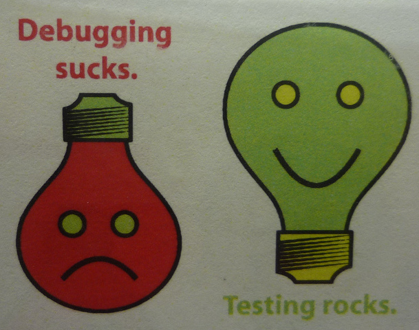
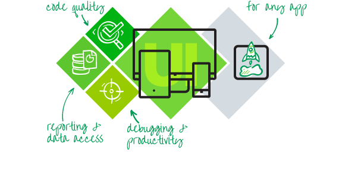

<!-- section start -->
# Mocking with Moq and JustMock
## Mocking tools for easier unit testing
<!--  -->
<!--  -->
<div class="signature">
	<p class="signature-course">- High Quality Code</p>
	<p class="signature-initiative">- Telerik Software Academy</p>
	<a href="- http://academy.telerik.com " class="signature-link">- http://academy.telerik.com </a>
</div>

<!-- section start -->
# Table of Contents
- Testable Code
- Mocking
- Moq
  - Moq demo
- JustMock
  - JustMock demo
<!--  -->

<!-- section start -->
# Testable Code
<!--  -->

# How to Write Testable Code
- Inversion of Control Pattern
  - There is a decoupling of the execution of a certain task from implementation
  - Every module can focus on what it is designed for
  - Modules make no assumptions about what other systems do but rely on their contracts
  - Replacing modules has no side effect on other modules
  - More info at http://en.wikipedia.org/wiki/Inversion_of_control 

# How to Write Testable Code
- Public API should work with interfaces, not implementation classes (IEnumerable vs. List)
- Bad code:
- Good code:

# How to Write Testable Code
- Dependency Injection
  - Ninject – http://www.ninject.org/ 
- Consists of:
  - A dependent consumer
  - A declaration of a component's dependencies, defined as interface contracts
  - An injector (sometimes referred to as a provider or container) that creates instances of classes that implement a given dependency interface on request

# How to Write Testable Code
- Bad:

# How to Write Testable Code
- Good:

<!-- section start -->
# Mocking
<!--  -->

# Mocking
- Makes Unit Testing more effective
  - Avoid writing boring boilerplate code
- Isolate dependencies among units
- Asserts expectations for code quality
  - Ex: Checks that a method is called only once

<!-- section start -->
# Moq
<!--  -->

# Moq
- Install from the NuGet package manager
- Refer the library
- Use its API
- https://github.com/Moq/moq4 

# Moq
- The most often used APIs:
  - .Setup()
  - .Verifiable()
  - .Callback()
  - .Returns()
  - .Throws()
  - It.Is<type>(x => condition)

<!-- section start -->
# Telerik JustMock
<!--  -->

# Telerik JustMock
- Install from the Telerik account
  - http://www.telerik.com/products/mocking.aspx
- Use the Visual Studio NuGet package manager

# Telerik JustMock
- Two versions:
  - Free version – excellent when the code is written with testability in mind
  - Paid version – mocks everything (mscorlib, EntityFramework, SQL), legacy code base which is not written to be testable, statics, privates, etc.
- More information here:
  - http://www.telerik.com/help/justmock/getting-started-commercial-vs-free-version.html

# Telerik JustMock
- The most often used APIs:
  - .CallOriginal()
  - .Returns()
  - .DoInstead()
  - .DoNothing()
  - .Throw()
  - Arg.Matches<type>(x => condition)

# Mocking
## [Demo]()
<!--  -->

# Mocking with Moq and JustMock

```js
http://academy.telerik.com
```

# Free Trainings @ Telerik Academy
- C# Programming @ Telerik Academy
    - csharpfundamentals.telerik.com
  - Telerik Software Academy
    - academy.telerik.com
  - Telerik Academy @ Facebook
    - facebook.com/TelerikAcademy
  - Telerik Software Academy Forums
    - forums.academy.telerik.com
<!--  -->
<!--  -->
<!--  -->
<!--  -->
